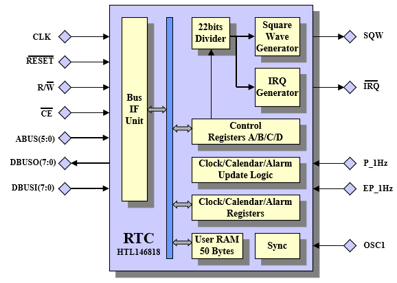
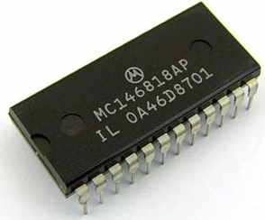
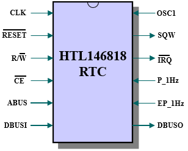

# HTL146818 Real Time Clock IP Core in VHDL 



## 1. Introduction 


The HTL146818 is a synchronous implementation of the industry standard 146818 Real Time Clock (RTC) written in VHDL. The RTC provides a real-time clock, calendar and alarm functions. In addition, 50 bytes of user memory, aprogrammable periodic interrupt and a square wave function are also provided.  
  

The RTC provides a real-time clock function in either 24 or 12-hour format with AM/PM indication. A time alarm can be programmed to trigger from once a second up to once a day. The calendar function compensates for leap-years up to the year 2099. The time, alarm and calendar values
can be programmed in either binary or BCD format. Three maskable interrupts (IRQ output) are provided to inform the processor of a *Alarm trigger*, *End of Update trigger* and a general purpose *Periodic trigger*. The End of Update trigger is provided so that registers can be updated without conflicting with the internal update function. The Periodic interrupt can be programmed to trigger from 30.5us up to 500ms.
The square wave output pin (SQW) can output one of the 13 taps from the internal 22 bits divider creating a 50% duty cycle signal which can
range from 8.192KHz down to 2Hz. The RTC is clocked from a 32.768KHz oscillator (OSC1) which is internally synchronised to the main processor
clock.

There are no software differences between the HTL146818 and a commercial 146818 device. For this reason no programming information is provided. Any commercial 146818 datasheet can be used to obtain this information.

## 2. Directory Structure

The directory structure is as follows:

| **Directory**       | **Contents**                                            |
|---------------------|---------------------------------------------------|
| HTL146818\doc       | Example 146818 Datasheet                                |
| HTL146818\rtl       | Synthesizable IP Core                                   |
| HTL146818\testbench | Testbench files                                         |
| HTL146818\Modelsim  | Example script for Modelsim/Questa                      |
| HTL146818\synthesis | Example Synthesis scripts for Gowin                     |

## 3. Filelist

The HTL146818 RTL design is divided in 14 VHDL files.


| **Filename**      | **Contains**                                     |
|-------------------|--------------------------------------------------|
| bin_2_bcd.vhd     | Binary to BCD Look-Up-Table                      |
| bin_2_bcdpm.vhd   | Convert binary hour to BCD AM/PM format          |
| binpm_2_bin.vhd   | Convert hours to 24-hour binary format           |
| bin_2_binpm.vhd   | Convert binary hour to 12-hour binary format     |
| bcd_2_bin.vhd     | Convert BCD to binary format                     |
| bcdpm_2_bin.vhd   | Convert hour BCD format to 24-hour binary format |
| redge.vhd         | Rising edge detector                             |
| redge3ff.vhd      | Dual FF plus rising edge detector                |
| ram_synch_in.vhd  | Generic memory model                             |
| mem_block_rtl.vhd | 50 bytes of user memory                          |
| clock_gen_rtl.vhd | Clock generator                                  |
| timefsm.vhd       | Control State Machine                            |
| alarm_rtl.vhd     | Alarm logic                                      |
| htl146818.vhd     | Top Level                                        |

A further 3 files are used for the testbench.


| **Filename**         | **Contains**                                              |
|-----------------|-------------------------------------------------------|
| tester_behaviour.vhd | Testbench Stimulus module                                 |
| edge_flag.vhd        | Edge detector and flag logic                              |
| top_rtc_tb.vhd       | Testbench, instantiates the HTL146818 and stimulus module |

## 4. Pin Description



| **Symbol** |  **Type** | **Function** |
|------------|-------|--------------------------------------------------|
| CLK        |   I   | Clock Input signal Note1                         |
| RESET      |   I   | Active Low Reset signal                          |
| R/W        |   I   | Active High Read/ Active Low Write Strobe        |
| CE         |   I   | Active Low Chip Select signal                    |
| ABUS       |   I   | 6 bits Address Bus                               |
| DBUSI      |   I   | 8-bits DataBus Input                             |
| DBUSO      |   O   | 8-bits DataBus Output                            |
| OSC1       |   I   | 32768Hz Oscillator Input Note2                   |
| SQW        |   O   | Square Wave Output signal                        |
| IRQ        |   O   | Active Low Interrupt                             |
| P_1Hz      |   I   | 1Hz Clock Pulse Input                            |
| EP_1Hz     |   I   | Active High Enable P_1Hz input signal            |

**Note1**: All actions are on the Rising Edge of the system clock.

**Note2**: This signal is synchronised to the system clock CLK using a 3
FF synchroniser.

## 5. Differences and Enhancements

The following section list some of the differences and enhancements of the HTL146818 compared to a commercial 146818 device.

### 5.1 1Hz Pulse Input

A standard 146818 RTC requires a 32768Hz oscillator (OSC1 input). This oscillator is used to drive the internal time and calendar update logic
and the periodic Square Wave (SQW) output.

Using an external 32768Hz oscillator or deriving this frequency from a PLL/DCM output is not always doable. For this reason the HTL146818 is enhanced with a 1Hz clock input (P1_Hz). This input is used for the time and calendar update logic only, the SQW signal and associated periodic interrupt is still derived from the 32768Hz OSC1 input.

To use the P1_Hz input the enable signal EP1_Hz must be asserted.

###  5.2 SQW Time Basis

Some commercial 146818 devices provide additional time bases for the SQW output and periodic interrupt signals. The HTL146818 provides only a single 32768Hz time basis. However, this can obviously easily be changed to any frequency by changing the external OSC1 clock divider.

Table1 shows the difference between the HTL146818 and some commercial 146818 devices

| **Time Base Frequency** | **DV2** | **DV1** | **DV0** | **MC146818** | **DS1287** | **HTL146818** | **Note** |
|-------------|------|------|------|------------|------------|------------|---------|
| 4.194304MHz             | 0       | 0       | 0       | ■            |            |               | 3        |
| 1/048576MHz             | 0       | 0       | 1       | ■            |            |               | 3        |
| 32.768KHz               | 0       | 1       | 0       | ■            | ■          | ■             | 4        |
| Divider Reset           | 1       | 1       | 0       | ■            | ■          | ■             |          |
| Divider Reset           | 1       | 1       | 1       | ■            | ■          | ■             |          |

*Table1 RegisterA DV2:0*

■ means function is supported

Note 3: This frequency can be obtained by changing the OSC1 input frequency

Note 4: After programming **010** into **DV2:0** the first time update occurs **500ms** later.

### 5.3 Data Mode

There is no restriction in changing the Data Mode (DM) bit, i.e. the driver can change this bit without re-initialising the registers.
However, the DM bit must be set to the correct value during a write cycle to the Time, Date and Alarm registers (address 0x00 to 0x09).

###  5.4 Update Logic

The HTL146818 logic is clocked from the clk input pin and not from the OSC1 input. The OSC1 clock edges are only used as an enable for the update logic. This means generally that the update time is significantly faster than the original 146818 device. The worst case update time is 6 clk cycles.

### 5.5 D-Register

Register D is added for compatibility reasons, the VRT bit is not used and will always read back as '1'.

### 5.6 Daylight Saving Mode

The Daylight Saving Mode is not implemented hence the DSE bit in Register B is ignored.

## 6. Simulation

The HTL146818 IP core is written in vendor neutral VHDL and as such can be simulated by any modern simulation tool. The testbench however uses Mentor Graphics’ Modelsim *SignalSpy* in order to read the internal second/minutes/hours/etc signals since they are not available on the top level I/O pins. 

Note: SignalSpy can be replace with VHDL2008 constructs.

To run the simulation, open a CMD prompt, navigate to the Modelsim directory and execute the ***run.bat***. An equivalent Modelsim run.do file can be executed from within the Modelsim/Questa GUI.

The output of the testbench is shown below. 

```
# vsim work.htl146818_tb -c -do "set StdArithNoWarnings 1; run -all; quit -f"
# Start time: 19:52:06 on May 09,2023
# //  ModelSim DE-64 2023.2 Apr 11 2023
# //
# //  Copyright 1991-2023 Mentor Graphics Corporation
# //  All Rights Reserved.
# //
# //  ModelSim DE-64 and its associated documentation contain trade
# //  secrets and commercial or financial information that are the property of
# //  Mentor Graphics Corporation and are privileged, confidential,
# //  and exempt from disclosure under the Freedom of Information Act,
# //  5 U.S.C. Section 552. Furthermore, this information
# //  is prohibited from disclosure under the Trade Secrets Act,
# //  18 U.S.C. Section 1905.
# //
# set StdArithNoWarnings 1
# 1
#  run -all
# 1) Checking Square Wave Output
# Divider set to 256Hz(3.9ms) Time=15624360 ns
# Divider set to 8192Hz(122us) Time=486180 ns
# Divider set to 128Hz(7.8ms) Time=31252050 ns
# Divider set to no output *** PASS ***
# First update after DV2:0=110 is = 999988879 ns
# 2) Checking Time/Clock Output in BIN mode
# Checking Time 23:59:58 + 2 seconds = 00:00:00 *** PASS ***
# 3) Checking Time/Clock Output in BCD mode
# Checking Time 23:59:58 + 2 seconds = 00:00:00 *** PASS ***
# 4) Checking 24hour to AM/PM conversion
# Checking Time 00:10:30 = 12:10:30 AM *** PASS ***
# Checking Time 10:10:30 = 10:10:30 AM *** PASS ***
# Checking Time 12:10:30 = 12:10:30 PM *** PASS ***
# Checking Time 13:10:30 = 01:10:30 PM *** PASS ***
# Checking Time 23:10:30 = 11:10:30 PM *** PASS ***
# 5) Checking AM/PM to 24hour conversion
# Checking Time 12:10:30AM = 00:10:30 *** PASS ***
# Checking Time 10:10:30AM = 10:10:30 *** PASS ***
# Checking Time 12:10:30PM = 12:10:30 *** PASS ***
# Checking Time 03:10:30PM = 15:10:30 *** PASS ***
# Checking Time 10:10:30PM = 22:10:30 *** PASS ***
# 6) Check for leap year
# Checking Leap Year 28-Feb-2007 -> 29-Feb-2008   *** PASS ***
# Checking None Leap Year 28-Feb-2007 -> 01-March-2007   *** PASS ***
# 7) Checking calender month
# Checking Jan30 -> Jan31   *** PASS ***
# Checking Mar30 -> Mar31   *** PASS ***
# Checking Apr30 -> Jun01   *** PASS ***
# Checking May30 -> May31   *** PASS ***
# Checking Jun30 -> Jul01   *** PASS ***
# Checking Jul30 -> Jul31   *** PASS ***
# Checking Aug30 -> Aug31   *** PASS ***
# Checking Sep30 -> Oct01   *** PASS ***
# Checking Oct30 -> Oct31   *** PASS ***
# Checking Nov30 -> Dec01   *** PASS ***
# Checking Dec30 -> Dec31   *** PASS ***
# Checking Dec31 -> Jan01   *** PASS, HAPPY NEW YEAR ***
# 8) Checking Alarm function
# Waiting for Alarm  *** PASS ***
# Waiting for Alarm  *** PASS ***
# Waiting for Alarm  *** PASS ***
# 9) Checking Periodic Interrupts
# Enable PIE, period=125ms,
# *** IRQ *** time between IRQ=500006160 ns
# *** IRQ *** time between IRQ=500006160 ns
# Enable PIE, period=122us,
# *** IRQ *** time between IRQ=489510 ns
# *** IRQ *** time between IRQ=489510 ns
# 10) Checking Update Ended Interrupts
# Enable UIE, period=1sec,
# *** IRQ *** time between IRQ=1000015650 ns
# *** IRQ *** time between IRQ=1000012320 ns
# 11) Checking Alarm Interrupts
# Set Alarm for 01:09:01, Waiting for IRQ.....
# *** IRQ *** Time = 01:09:01 *** PASS ***
# ** Failure: *** All tests passed ***
#    Time: 35001608491 ns  Iteration: 0  Process: /htl146818_tb/U_1/line__94 File: ../testbench/tester_behaviour.vhd
# Break in Process line__94 at ../testbench/tester_behaviour.vhd line 1107
# Stopped at ../testbench/tester_behaviour.vhd line 1107
#  quit -f
# End time: 19:53:03 on May 09,2023, Elapsed time: 0:00:57
# Errors: 1, Warnings: 0
```

## 7. Synthesis

An example synthesis script for the tiny *Gowin GW1NZ-LV1* is provided. 

To run the synthesis, edit the **run.bat** file and correct the path to the Gowin command shell *(<install_path>\IDE\bin\gw_sh.exe)*. 
Next open a Windows CMD prompt, navigate to the Synthesis directory and execute **run.bat**.


```
GW1NZ-LV1QN48C6/I5 Resource Usage Summary

  ----------------------------------------------------------
  Resources                   | Usage
  ----------------------------------------------------------
  Logic                       | 660/1152  58%
    --LUT,ALU,ROM16           | 660(637 LUT, 23 ALU, 0 ROM16)
    --SSRAM(RAM16)            | 0
  Register                    | 538/957  57%
    --Logic Register as Latch | 0/864  0%
    --Logic Register as FF    | 537/864  63%
    --I/O Register as Latch   | 0/93  0%
    --I/O Register as FF      | 1/93  2%
  CLS                         | 534/576  93%
  I/O Port                    | 31
  I/O Buf                     | 31
    --Input Buf               | 21
    --Output Buf              | 10
    --Inout Buf               | 0
  IOLOGIC                     | 0%
  BSRAM                       | 0%
  PLL                         | 0/1  0%
  DCS                         | 0/4  0%
  DQCE                        | 0/12  0%
  OSC                         | 0/1  0%
  User Flash                  | 0/1  0%
  CLKDIV                      | 0/4  0%
  DLLDLY                      | 0/4  0%
  DHCEN                       | 0/8  0%
  ==========================================================
  
Max Frequency Summary
  NO.   Clock Name   Constraint    Actual Fmax   Level   Entity  
 ===== ============ ============= ============= ======= ======== 
  1     clk          27.027(MHz)   66.055(MHz)   4       TOP     
  
```
                                      
## License

See the LICENSE file for details.

## Notice
ModelSim®, Questa, QuestaSim and their respective logos are trademarks or registered trademarks of Siemens Industry Software Limited.
All other trademarks are the property of their respective owners.
